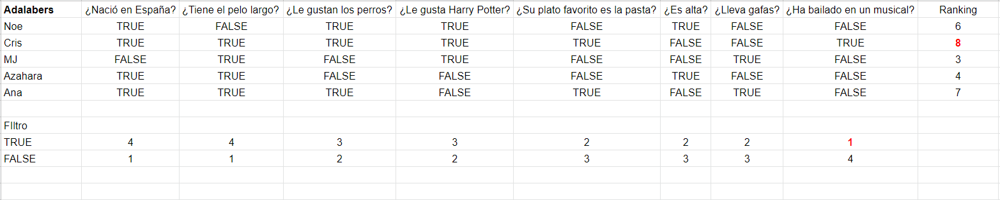

# AKINATOR || ADA-NATOR

## Intro

Es mi primer proyecto personal dentro del mundo de la programación y agradezco cualquier tipo de feedback constructivo que queráis hacerme. ¡Gracias! :)

## Objetivos personales

Mejorar mis conocimientos de JavaScript y React.

- Manejo de estructura de datos.
- Realizar una interfaz de usuario con React.

Mejorar mis conocimientos de CSS con una librería: Bootstrap.

## Objetivo del proyecto

#### ¿Qué es akinator?

Wikipedia: Akinator es un juego en línea, creado en agosto de 2007 en Francia, que consiste en un genio que puede adivinar qué personaje está pensando el usuario, sea real o no, a través de preguntas sobre las características del mismo.

#### ¿Por qué un akinator?

Porque es divertido y puedo "construir" con lo que más me gusta en la programación: Javascript. Es todo un reto que espero ir complejizando poco a poco a medida que voy madurando como programadora.

#### ¿Qué tipo de akinator?

Uno sencillo y que empiece con lo más cercano, mis compañeras adalabers. Quiero diseñar un akinator de mi promoción y posteriormente adaptarlo al mundo de las mujeres científicas o mi nuevo mundo: la programación. Con preguntas del tipo, ¿es un grupo de datos compuestos por una clave a la que va asociada un valor?, ¿es una propiedad de CSS3 que permite colocar los elementos en una página?, etc. Y estos son mis objetivos señores, y dicho esto...¡al turrón!

## Fases del proyecto

### Fase 1: Requisitos

#### ¿Cuales son las condiciones o "reglas de juego" para poder desarrollar mi akinator?

1. Definir la estructura de los datos (preguntas, respuestas, información usuarios...) y si los traigo de un servidor, tratarlos antes y definir dicha estructura.

2. Conseguir que sea lo más genérico posible y sea adaptable a cualquier tipo de estructura de datos (con el tiempo, una caña y una buena base que vaya mejorando).

3. Definir la estructura de preguntas y su recorrido de dos maneras; una que vaya accediendo consecutivamente a las preguntas de una en una. Y otra que pueda elegir "a la carta" a través de una función que trabaje de manera independiente al flujo de trabajo.

4. Definir tipo de estructura de trabajo del Akinator.

- Árbol (true o false): "este es el camino" The mandalorian.
- #### Filtro (50 => 25 => 5): descartes rules.
- Contador (1:++ 2:+++++ 3:+...): que gane el mejor.

5. Diseñar un testing dentro de la App con un ranking de datos, para saber que tipo de estructura funciona mejor (¿Es mejor árbol, filtro o ranking?).

### Fase 2: Prototipo

- [x] He diseñado la aplicación en React y por lo tanto la he dividido en componentes. Posteriormente he hecho que subieran los datos por lifting hasta App; donde desarrollo toda la lógica ('magic javascript')
- [x] He creado una pequeña base de datos que se llama 'question.json' en función del excel de preguntas que hice al comienzo de mi akinator, que lo usé inicialmente para saber más o menos como se comportaría mi akinator.

